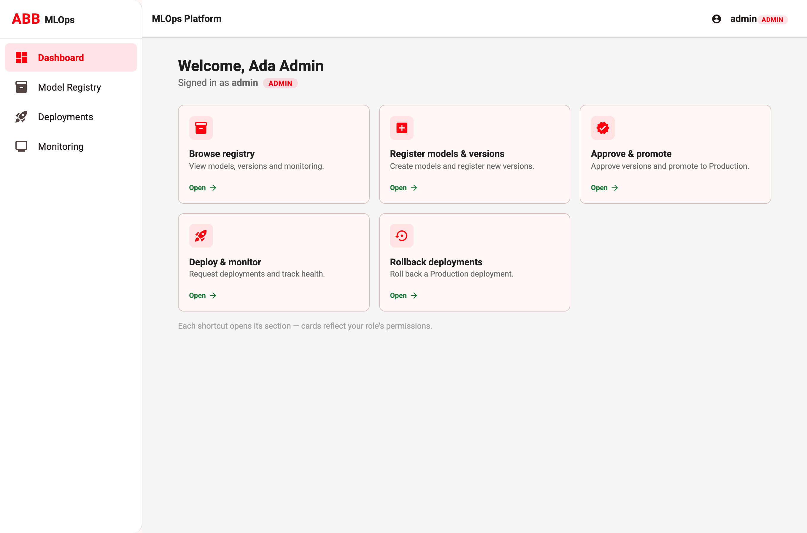
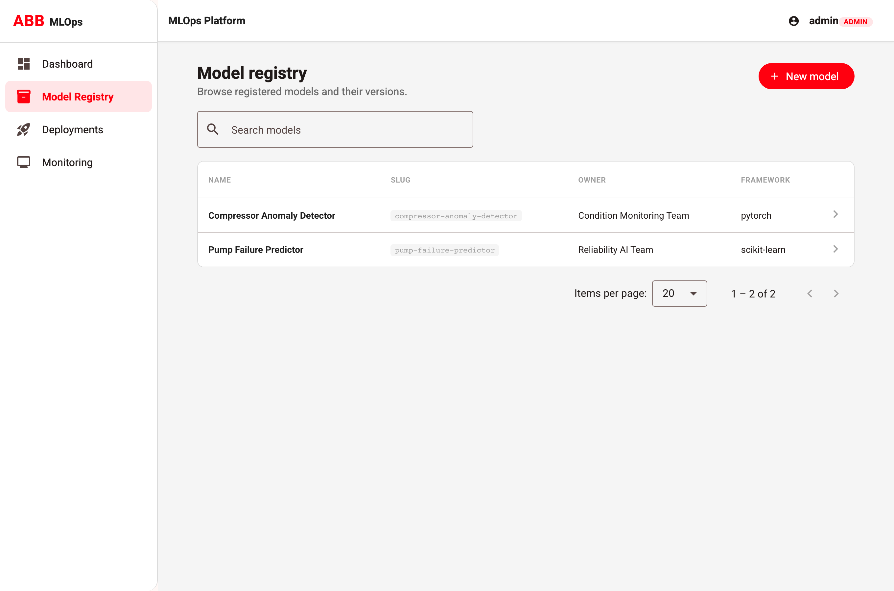
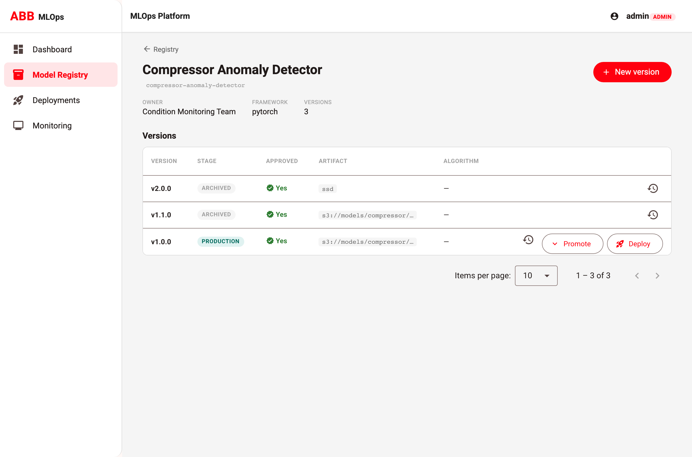
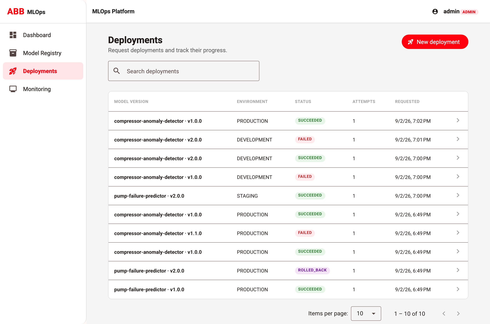
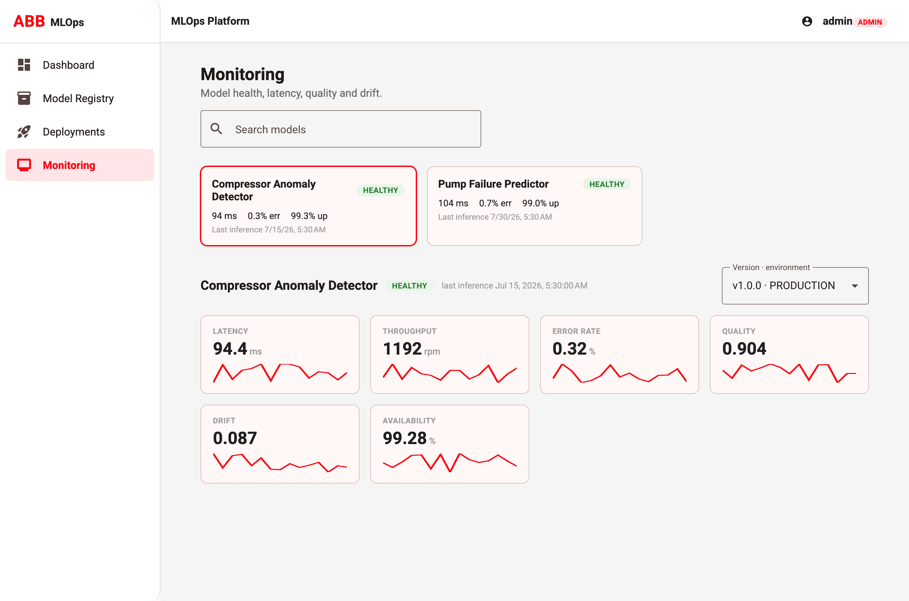

# MLOps Platform — Technical Assignment

**Role level:** G12 (Principal Software Engineer / Technical Lead)

A control-plane application for managing the lifecycle of machine-learning models across
plants and environments: **register, version, approve, deploy, monitor, and roll back**.

> The focus is production-quality engineering and platform thinking, not model training.

## Problem statement

ML teams accumulate many models, each with multiple versions, promoted through environments
(development → staging → production). Without a control plane this becomes ungoverned: versions
are deployed without approval, two deployments race for the same environment, failures leave no
audit trail, and operators have no single view of model health. This platform provides a
governed registry, an asynchronous deployment pipeline with safe rollback, and a monitoring
view — with role-based access and a full audit history throughout.

## Architecture summary

A layered **FastAPI** backend exposes a camelCase REST API to an **Angular** operational UI.
Business logic lives in a service layer over **SQLAlchemy 2.0** / **PostgreSQL**. Long-running
deployments are executed **asynchronously** by a separate worker process that uses the
`deployments` table as a durable work queue (Postgres `SELECT … FOR UPDATE SKIP LOCKED`, with
`LISTEN/NOTIFY` push and a poll/reaper fallback). Governance — forward-only lifecycle,
stage-gated deployment eligibility, one-active-deployment-per-environment, idempotency, and
audit trails — is enforced in the domain layer and, where it must be race-free, in the database.

See **[docs/architecture.md](docs/architecture.md)** for the full document and diagram, and
**[docs/adr/](docs/adr/)** for the decision records.

## Tech stack

| Layer     | Technology                                                              |
|-----------|-------------------------------------------------------------------------|
| Backend   | Python 3.14, FastAPI, SQLAlchemy 2.0, Pydantic v2, Alembic, structlog    |
| Database  | PostgreSQL (app + migrations) / in-memory SQLite (tests)                 |
| Worker    | Standalone Python process; DB-as-queue with `FOR UPDATE SKIP LOCKED`     |
| Auth      | JWT bearer tokens, role-based access control                             |
| Frontend  | Angular 22 (standalone + signals), TypeScript, Angular Material, RxJS    |
| Packaging | Docker, Docker Compose (db, backend, worker, frontend)                   |
| CI        | GitHub Actions (ruff + pytest; prettier + build + vitest)               |

> Python **3.14** is required — primary keys are time-ordered UUIDv7 via the stdlib
> `uuid.uuid7` (see [ADR-0003](docs/adr/0003-identifier-strategy.md)).

## Repository layout

```text
backend/    FastAPI service + async worker (registry, deployments, monitoring)
frontend/   Angular operational UI
docs/       Architecture, diagram, ADRs, API design, test strategy, leadership artifacts
data/       Sample/seed data (models, metrics, deployment events)
.github/    CI workflow
```

## Getting started

### Everything via Docker (recommended)

```bash
docker compose up --build
# frontend :4200   backend :8000   db :5432   worker (background)
```

On first start the backend applies Alembic migrations and seeds demo users + a coherent sample
dataset (models, versions with lifecycle history, deployments, and monitoring metrics).

Port `4200` must be free before starting (a stray dev server will block the bind).

### Local (without Docker)

```bash
# Backend (Python 3.14) — needs a running Postgres
cd backend
python3 -m venv .venv && source .venv/bin/activate
pip install -r requirements.txt
uvicorn app.main:app --reload          # API + docs at http://localhost:8000/docs
python -m app.worker                    # in a second shell: the deployment worker

# Frontend
cd frontend
npm install
npm start                               # http://localhost:4200 (proxies /api -> :8000)
```

### Demo users

All seeded users share the password **`demo1234`** (demo only). Roles are ordered
`VIEWER < ENGINEER < APPROVER < ADMIN`:

| Username   | Role     | Can do                                             |
|------------|----------|----------------------------------------------------|
| `viewer`   | VIEWER   | Read registry + monitoring                          |
| `engineer` | ENGINEER | + create models/versions, request deployments       |
| `approver` | APPROVER | + approve versions, promote to production            |
| `admin`    | ADMIN    | + roll back deployments (full access)                |

## Tests

```bash
# Backend — unit + API + integration (in-memory SQLite)
cd backend && ruff check . && pytest

# Frontend — component/service unit tests + build
cd frontend && npm run format:check && npm run build && npm test -- --watch=false
```

CI runs the same checks on every PR — see [`.github/workflows/ci.yml`](.github/workflows/ci.yml)
and [docs/test-strategy.md](docs/test-strategy.md).

## API documentation

Interactive OpenAPI docs are served by the backend at **http://localhost:8000/docs** (ReDoc at
`/redoc`). A narrative overview of the endpoints, status codes and error contract is in
**[docs/api-design.md](docs/api-design.md)**.

## Sample workflow (end-to-end)

Register a model → add a version → validate & approve it → deploy to an environment → watch the
async worker drive it to `SUCCEEDED` → view metrics in Monitoring → roll back a production
deployment. Attempting to deploy an unapproved version, or a second concurrent deployment to the
same environment, is rejected with `409`. Duplicate requests are deduplicated by idempotency key.

## Screenshots

| View | |
|------|--|
| Dashboard launchpad |  |
| Model registry |  |
| Model detail — versions & lifecycle |  |
| Deployments |  |
| Monitoring |  |

## Documentation index

- [Architecture](docs/architecture.md) · [Architecture Q&A (G12 scaling questions)](docs/architecture-questions.md)
- [API design](docs/api-design.md) · [Test strategy](docs/test-strategy.md) · [Known limitations](docs/known-limitations.md)
- [ADRs](docs/adr/) (0001–0009)
- Leadership: [Delivery plan](docs/delivery-plan.md) · [Risk register](docs/risk-register.md) · [Roadmap](docs/roadmap.md) · [Code-review checklist](docs/code-review-checklist.md) · [Production-readiness checklist](docs/production-readiness-checklist.md)

## Known limitations

Kept deliberately in scope for the time-box — highlights below, full list in
[docs/known-limitations.md](docs/known-limitations.md):

- The deployment worker **simulates** the runtime rollout (state transitions + timing), rather
  than calling a real Kubernetes/serving backend.
- Tests exercise the domain on SQLite; Postgres-only behaviour (partial indexes, `SKIP LOCKED`)
  is guarded and verified against the running database, not in the unit suite.
- Single-tenant; multi-tenancy is designed for but not implemented (see the architecture Q&A).

## Future improvements

Real runtime adapters (K8s/KServe), OpenTelemetry tracing + metrics export, metric partitioning
for scale, and multi-tenant isolation. See [docs/roadmap.md](docs/roadmap.md).
