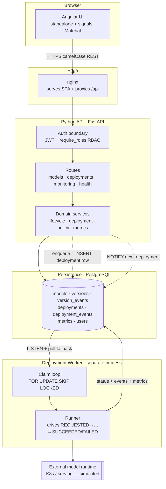
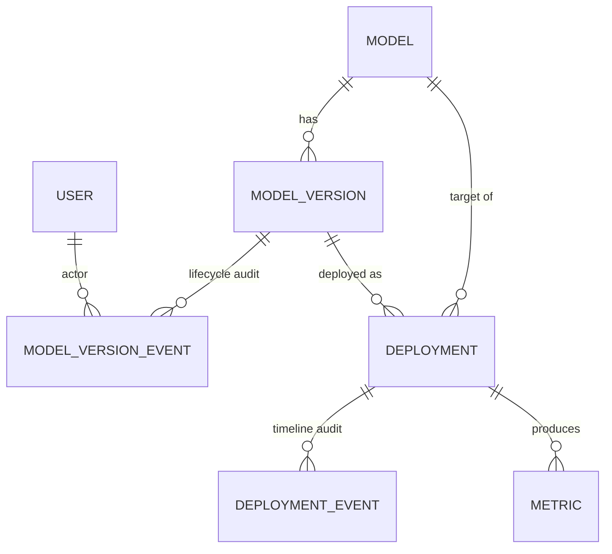

# Architecture

## Context

An MLOps control plane for industrial ML models. Operators and ML engineers register models,
cut versions, move each version through a governed lifecycle, deploy approved versions to
environments, watch health metrics, and roll back when a release misbehaves. The system is the
**source of truth and the governance gate** between model authors and running environments; it
does not train models or serve inference itself.

## Scope

**In scope:** model/version registry, forward-only lifecycle with approvals, asynchronous
deployment execution with retry and rollback, per-version monitoring metrics, role-based access,
and end-to-end audit history. **Out of scope:** model training, the actual serving runtime
(simulated here behind a worker), feature stores, and experiment tracking.

## Architecture Overview

Required boundaries in the diagram: **Angular UI**, **Python API**, **domain services**,
**persistence**, **worker/queue**, **monitoring** (metrics table + monitoring service),
**external model runtime**, and the **authentication boundary** (JWT/RBAC in front of routes).

## Components

| Component | Responsibility | Notes |
|-----------|----------------|-------|
| **Angular UI** | Operator console: registry, deployments, monitoring, dashboard | Standalone components + signals; talks only to same-origin `/api` (ADR: no CORS layer) |
| **nginx** | Serve the SPA and proxy `/api` → backend | Same contract in dev (`proxy.conf.json`) and prod |
| **Auth boundary** | Authenticate JWT, enforce `require_roles` | Roles `VIEWER<ENGINEER<APPROVER<ADMIN`; ADMIN always passes ([ADR-0002](adr/0002-authentication-and-rbac.md)) |
| **Routes** | HTTP surface, request/response schemas | Thin; delegate to services; camelCase JSON ([ADR-0004](adr/0004-api-naming-convention.md)) |
| **Domain services** | Business rules: lifecycle, eligibility, deployment orchestration, metric rollups | Take an explicit `Session`; no repository layer ([ADR-0001](adr/0001-persistence-access-pattern.md)) |
| **Deployment worker** | Execute long-running rollouts off the request path | Separate container; DB-as-queue ([ADR-0007](adr/0007-async-deployment-execution.md)) |
| **Persistence** | Durable state + the work queue + audit trails | PostgreSQL; Alembic migrations |
| **Monitoring** | Derive health from the latest metric per (version, environment) | `metric_service`; HEALTHY/DEGRADED/NO_DATA rollup |

## Domain Model

- **Model** — registry entry (key, name, owner, framework).
- **ModelVersion** — an immutable artifact reference with a `stage` (DRAFT…PRODUCTION/ARCHIVED).
- **ModelVersionEvent** — append-only lifecycle audit (from_stage → to_stage, actor, correlation id).
- **Deployment** — a request to place a version in an environment; **doubles as the queue row**.
- **DeploymentEvent** — append-only per-step timeline of a deployment.
- **Metric** — a monitoring sample linked to the deployment that produced it.
- **User** — demo identities backing RBAC and the audit trail.

Identifiers are time-ordered **UUIDv7** so list endpoints paginate newest-first by `id`
([ADR-0003](adr/0003-identifier-strategy.md)).

## Key Workflows

**Lifecycle (forward-only)** — `DRAFT → VALIDATED → APPROVED → STAGING → PRODUCTION`, with
`ARCHIVED` terminal. No demotions; each transition is validated by a state machine and audited
([ADR-0005](adr/0005-lifecycle-state-machine.md)). Reaching APPROVED/STAGING/PRODUCTION requires
an APPROVER.

**Deployment (async)** —
1. `POST /deployments` validates **eligibility** (stage-gating: DRAFT/ARCHIVED never deployable;
   VALIDATED→dev, STAGING→dev+staging, PRODUCTION→all — [ADR-0009](adr/0009-deployment-eligibility.md))
   and the **one-active-per-environment** guard (partial unique index), then **inserts a
   REQUESTED row** — the insert *is* the enqueue.
2. The API `NOTIFY`s; the worker (or its poll fallback) **claims** the row with
   `FOR UPDATE SKIP LOCKED`, binds the request's correlation id, and drives it
   `VALIDATING → DEPLOYING → SUCCEEDED` (or `FAILED`), writing a `DeploymentEvent` per step.
3. **Retry** re-queues a FAILED deployment; **rollback** (ADMIN) supersedes a SUCCEEDED
   production deployment and records the target it rolled back to ([ADR-0008](adr/0008-idempotency-and-rollback.md)).

**Monitoring** — the worker writes metrics against the deployment; the monitoring service rolls
up the latest sample per (version, environment) into a health status for the dashboard.

## Reliability

- **At-least-once execution** with an **idempotent** claim: a duplicate request is deduped by
  idempotency key; the DB guarantees at most one *active* deployment per (model, environment).
- **Crash recovery**: a visibility-timeout **reaper** re-queues rows whose worker died mid-run
  (`worker_id`/`locked_at`/`attempts`).
- **No dual-write**: enqueue is a row insert in the same DB transaction as the domain change, so
  the queue can never disagree with the registry (see architecture Q&A #3).
- **Health/readiness**: `/health` (liveness) and `/ready` (checks DB reachability) back
  container/K8s probes.

## Security

- JWT bearer auth; `require_roles(...)` guards governance-critical endpoints and returns `403`.
- Least privilege by role (create vs approve vs rollback are distinct rights).
- Secrets via environment (`JWT_SECRET`) — never committed; `.env.example` documents the knobs.
- Same-origin `/api` (nginx/proxy) removes the CORS attack surface.
- Every state change is attributable (actor + correlation id in the audit tables).

## Observability

Structured JSON logging via **structlog**; a `CorrelationIdMiddleware` binds a per-request
correlation id (from `X-Request-ID` or generated) into log context and echoes it in the
response, and that id is **carried across the API→worker boundary** on the deployment row
([ADR-0006](adr/0006-observability-logging.md)). Domain events are logged as structured
key/values; failures are classified (`domain_error` with type + status, `deployment_failed`
with cause). Health/readiness endpoints and monitoring metrics complete the picture; a
Grafana/OTel dashboard is proposed in the roadmap.

## Scaling

- **Stateless API + worker** scale horizontally; `SKIP LOCKED` lets N workers share the queue
  without coordination.
- **Read-mostly registry** scales via indexes + pagination (newest-first by UUIDv7) and,
  later, read replicas and caching.
- **Metrics** are the high-volume table; the path to time-based partitioning / downsampling /
  a TSDB is described in the [architecture Q&A](architecture-questions.md) (#1, #6).

## Trade-offs

| Decision | Chosen | Rejected | Why |
|----------|--------|----------|-----|
| Queue transport | DB-as-queue (`SKIP LOCKED`) | SQS / Redis / Kafka | No extra infra for the assignment scale; no dual-write; clean upgrade path (ADR-0007) |
| Persistence access | Service + explicit `Session` | Repository pattern | Less ceremony, idiomatic SQLAlchemy 2.0 (ADR-0001) |
| Concurrency guard | Partial unique index in DB | App-level check | Race-free under concurrent requests (ADR-0008/0009) |
| Rollback | New superseding deployment | Mutate prior row | Preserves audit history; forward-only invariant holds |
| IDs | UUIDv7 | Auto-increment int | Time-ordered + non-guessable; enables id-based pagination (ADR-0003) |

Full per-decision rationale lives in the [ADRs](adr/); the [G12 scaling questions](architecture-questions.md)
extend this to 10k models, multi-tenancy, zero-downtime migrations, and team split.
